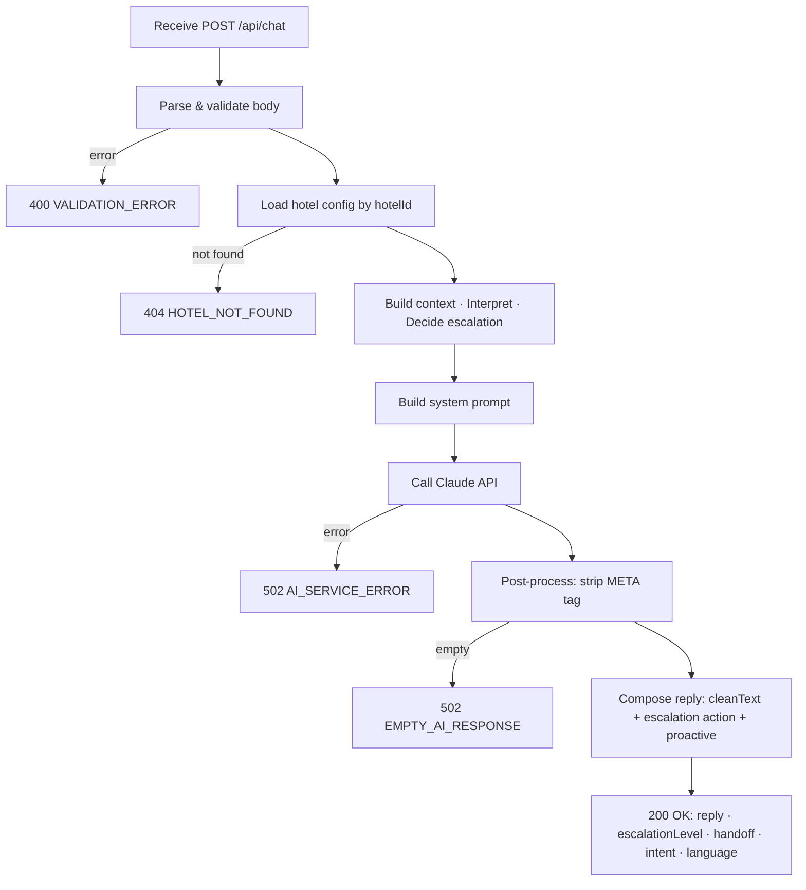

# API Design

## Overview

Curt AI exposes a single server-side API route. All client-to-server communication flows through this endpoint. No public REST API exists beyond this route — it is an internal BFF (Backend for Frontend) endpoint, not a public API.

Satisfies: `CON-serverside-ai-calls`, `REQ-SEC-api-key-server-only`, `REQ-F-escalation-detection`, `REQ-PERF-response-latency`.

---

## Endpoint

### `POST /api/chat`

The single entry point for all guest chat interactions. Orchestrates the full AI pipeline and returns a structured response.

**Route file**: `app/api/chat/route.ts`

---

### Request

**Headers**

| Header | Value |
|--------|-------|
| `Content-Type` | `application/json` |

**Body**

```ts
{
  hotelId: string           // Hotel URL slug, e.g. "grand-hotel"
  message: string           // Guest's current message
  history: ChatMessage[]    // Prior messages in this session
  guestContext?: {          // Optional — passed when guest is identified
    name: string
    room?: string
    stayNights?: number
  }
}

type ChatMessage = {
  role: 'user' | 'assistant'
  content: string
}
```

**Constraints**
- `hotelId` must be a non-empty string
- `message` must be a non-empty string
- `history` must be an array (may be empty `[]`)
- `guestContext` is optional; if present, `name` is required

---

### Responses

#### `200 OK` — Success

```ts
{
  reply: string             // Final guest-facing message (META tag stripped)
  escalationLevel: number   // 0 = normal, 1 = soft/amber, 2 = staff notified, 3 = critical
  handoff: boolean          // true when staff handoff has been triggered
  intent: string            // Detected intent: "greeting" | "question" | "complaint" | "emergency" | "booking_change" | "compliment" | "farewell"
  language: string          // ISO 639-1 language code Claude responded in (e.g. "en", "de", "fr")
}
```

**Escalation level semantics**

| Level | Meaning | UI rendering |
|-------|---------|-------------|
| `0` | Normal response | White bubble, neutral border |
| `1` | Soft escalation — staff should be aware | Amber bubble (`bg-amber-50`) |
| `2` | Hard handoff — staff notified | Red bubble (`bg-red-50`) + "Staff member notified" label |
| `3` | Critical (emergency/safety) | Same as 2; `handoff: true` always set |

---

#### `400 Bad Request` — Validation error

```ts
{
  error: string       // Human-readable message
  code: "VALIDATION_ERROR" | "INVALID_JSON" | "MISSING_FIELD" | "INVALID_FIELD"
  requestId: string   // UUID for log correlation
  detail?: string     // Field-level detail if available
}
```

#### `404 Not Found` — Hotel not found

```ts
{
  error: "Hotel not found."
  code: "HOTEL_NOT_FOUND"
  requestId: string
  detail?: string
}
```

#### `502 Bad Gateway` — Upstream AI failure

```ts
{
  error: string
  code: "AI_SERVICE_ERROR" | "EMPTY_AI_RESPONSE"
  requestId: string
  detail?: string
}
```

---

### Error Codes Reference

| Code | HTTP | Cause |
|------|------|-------|
| `INVALID_JSON` | 400 | Request body is not valid JSON |
| `VALIDATION_ERROR` | 400 | Request body fails schema validation |
| `MISSING_FIELD` | 400 | Required field absent |
| `INVALID_FIELD` | 400 | Field present but invalid type or value |
| `HOTEL_NOT_FOUND` | 404 | `hotelId` does not match a known hotel |
| `AI_SERVICE_ERROR` | 502 | Anthropic API returned an error |
| `EMPTY_AI_RESPONSE` | 502 | Anthropic API returned an empty response |

---

### Request Lifecycle



---

### Performance Target

`REQ-PERF-response-latency`: complete response within **8 seconds at p95**.

The dominant latency factor is the Claude API call. Supabase queries (once integrated) must add less than 500ms (`ASM-supabase-latency-acceptable`). The endpoint does not currently stream — if latency becomes a concern, streaming via `ReadableStream` / Server-Sent Events is the first mitigation.

---

### Security

- The Anthropic API key is accessed only via `process.env.ANTHROPIC_API_KEY` inside the route handler — never passed to client code or included in any response. Satisfies `REQ-SEC-api-key-server-only`.
- Rate limiting is applied by `lib/security/rate-limit.ts` before the pipeline runs.
- No authentication is required for the prototype. Production will require session-based or token-based auth.

---

## Staff API Endpoints

Staff-facing endpoints protected by the `staff-session` httpOnly cookie (verified via `lib/security/require-staff-auth.ts`). All requests must include the cookie; returns `401` if missing or expired.

---

### `GET /api/knowledge?hotelId=<id>`

Returns all knowledge items for a hotel, ordered by category then title.

**Response `200 OK`**
```ts
{ items: KnowledgeItem[] }

type KnowledgeItem = {
  id: string
  category: string
  title: string
  content: string
  language: string
  active: boolean
  created_at: string
  updated_at: string
}
```

---

### `POST /api/knowledge`

Creates a new knowledge item.

**Body**
```ts
{ hotelId: string; category: string; title: string; content: string; language?: string }
```

**Response `201 Created`**: `{ item: KnowledgeItem }`

---

### `PATCH /api/knowledge/[id]`

Updates one or more fields of a knowledge item. Accepts any subset of `{ category, title, content, language, active }`. Used for both inline edits and the active/inactive toggle.

**Response `200 OK`**: `{ ok: true }`

---

### `PATCH /api/cases/[caseId]`

Updates a case's status, staff note, or assigned_to. Used by the Operations Inbox.

**Body**: `{ status?: CaseStatus; staffNote?: string; assignedTo?: string }`

**Response `200 OK`**: `{ ok: true }`

---

## Future Endpoints

| Endpoint | Purpose | Requirement |
|----------|---------|-------------|
| `GET /api/hotel/:hotelId/conversations` | List conversations for analytics | `REQ-F-conversation-persistence` |
