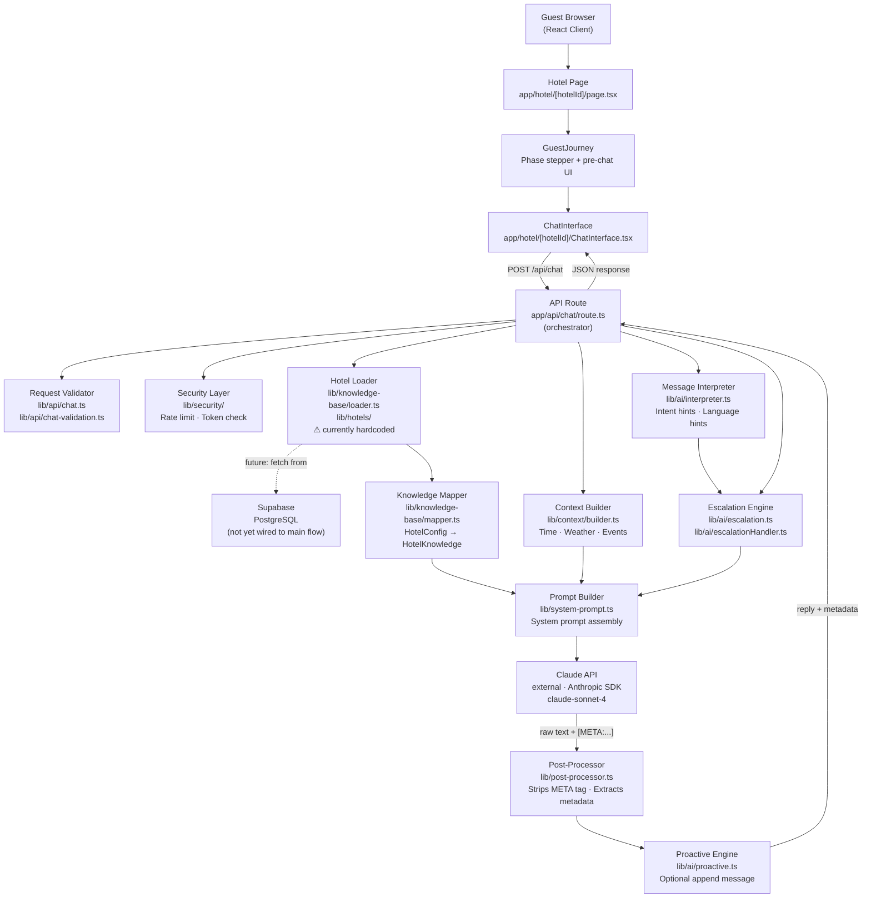
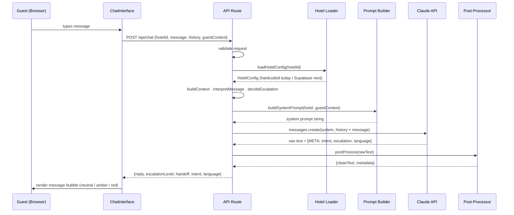

# Architecture

## Overview

Curt AI is a Next.js application with a single server-side AI pipeline. The guest interacts via a React client; all intelligence runs server-side through a sequence of focused modules that build context, call Claude, and post-process the response.

Satisfies: `REQ-SEC-api-key-server-only`, `REQ-F-escalation-detection`, `REQ-F-language-detection-response`, `REQ-F-knowledge-grounded-response`, `CON-anthropic-api-only`, `CON-serverside-ai-calls`.

---

## Component Map

---

## Components

### Guest UI
**Files**: `app/hotel/[hotelId]/page.tsx`, `GuestJourney.tsx`, `ChatInterface.tsx`

Server-rendered hotel page loads hotel config and passes it to client components. `GuestJourney` manages the three-phase stepper (pre-arrival → check-in day → stay). `ChatInterface` renders the conversation and POSTs messages to `/api/chat`. Escalation level from the API response drives message bubble styling (neutral / amber / red). Satisfies `REQ-USA-journey-phase-ui`.

### API Route
**File**: `app/api/chat/route.ts`

Single `POST` handler. Orchestrates the full pipeline: validate → load hotel → map → build context → interpret → decide escalation → build prompt → call Claude → post-process → return response. Runs entirely server-side. Satisfies `CON-serverside-ai-calls`, `REQ-SEC-api-key-server-only`.

### Request Validator
**Files**: `lib/api/chat.ts`, `lib/api/chat-validation.ts`

Parses and validates the request body (`hotelId`, `message`, `history`, `guestContext`). Returns typed `ChatApiError` with structured error codes on failure.

### Security Layer
**Files**: `lib/security/rate-limit.ts`, `lib/security/chat-token.ts`

Rate limiting per client and optional chat token validation. Protects the API route from abuse.

### Hotel Loader ⚠ Integration Target
**Files**: `lib/knowledge-base/loader.ts`, `lib/hotels/grand-hotel.ts`, `lib/hotels/index.ts`

**Current state**: loads hotel config from hardcoded TypeScript files. **Target state**: fetch `accounts`, `knowledge_bases`, and `documents` from Supabase by `hotelId`. This is the primary Supabase integration point. Satisfies `REQ-F-knowledge-base-from-supabase`, `REQ-F-hotel-routing` (once migrated).

### Knowledge Mapper
**File**: `lib/knowledge-base/mapper.ts`

Transforms `HotelConfig` (rich internal type) into `HotelKnowledge` (Claude-optimized flat structure used in system prompt generation).

### Context Builder
**File**: `lib/context/builder.ts`

Builds realtime context: local time and date (timezone-aware), weather (mock), local events (mock). Injected into system prompt for time-aware responses.

### Message Interpreter
**File**: `lib/ai/interpreter.ts`

Pre-processes the guest message before Claude: extracts intent hints and detected language. Results feed into the escalation engine and supplement Claude's own metadata.

### Escalation Engine
**Files**: `lib/ai/escalation.ts`, `lib/ai/escalationHandler.ts`

Rule-based pre-decision on escalation level (0–3) based on message content and hotel config. Produces an `EscalationAction` — text to append to the response and a `handoff` flag. Claude's own escalation signal (from the META tag) is combined with this pre-decision via `Math.max`. Satisfies `REQ-F-escalation-detection`, `REQ-F-handoff-notification`.

### Prompt Builder
**File**: `lib/system-prompt.ts`

Assembles the full system prompt: personality, tone, 8 core rules (language matching, brevity, escalation triggers, scope), HEARD complaint framework, and the hotel knowledge base as a structured text block. Also embeds guest context (name, room). The META tag instruction at the end tells Claude to append `[META: intent=..., escalation=..., language=...]` to every response. Satisfies `REQ-F-knowledge-grounded-response`, `REQ-F-language-detection-response`, `REQ-F-journey-phase-context`.

### Claude API
**External**: Anthropic SDK, `claude-sonnet-4`

Receives the system prompt + message history. Returns a text response with an embedded `[META:...]` tag containing structured escalation and language metadata. Satisfies `CON-anthropic-api-only`.

### Post-Processor
**File**: `lib/post-processor.ts`

Parses the `[META: intent=..., escalation=..., language=...]` tag from Claude's raw response. Returns `{ cleanText, metadata }`. If the tag is absent, falls back to safe defaults. Satisfies `REQ-F-escalation-detection` (classification step).

### Proactive Engine
**File**: `lib/ai/proactive.ts`

Optionally appends a proactive suggestion (e.g., event tip, weather note) to the AI reply based on hotel config and current context. Controlled by `hotel.proactive` settings.

### Supabase
**Files**: `lib/supabase/client.ts`, `lib/supabase/server.ts`, `lib/supabase/types.ts`

Supabase client instances (browser and server). Schema types auto-generated. **Not yet wired into the main request flow** — the integration target is the Hotel Loader. Satisfies `CON-supabase-backend` (structurally; functional integration pending).

---

## Request Flow

---

## Current Limitations

| Area | Current State | Target State | Requirement |
|------|--------------|--------------|-------------|
| Hotel config source | Hardcoded TypeScript files | Supabase `accounts` + `knowledge_bases` + `documents` | `REQ-F-knowledge-base-from-supabase`, `REQ-F-hotel-routing` |
| Conversation storage | Not persisted | Write to Supabase `conversations` + `messages` per request | `REQ-F-conversation-persistence` |
| Account data scoping | N/A (single hardcoded hotel) | All queries filter by `account_id` | `REQ-F-account-scoped-data` |
| Context (weather/events) | Mock data | Live data or configurable mock | Future |
