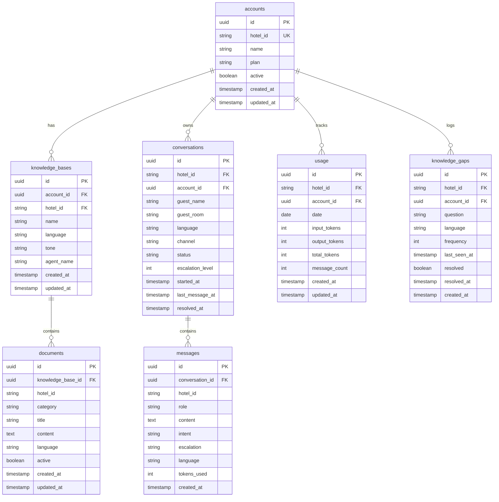

# Data Model

## Overview

All persistent data lives in Supabase (PostgreSQL). The schema is already migrated (`supabase/migrations/001_initial_schema.sql`). TypeScript types are auto-generated in `lib/supabase/types.ts`.

Every hotel-specific table includes `account_id` and `hotel_id` for multi-tenant scoping. Satisfies `REQ-F-account-scoped-data`, `CON-supabase-backend`.

---

## Entity Relationships

---

## Tables

### `accounts`
One row per hotel. The top-level tenant record.

| Column | Type | Notes |
|--------|------|-------|
| `id` | uuid PK | Auto-generated |
| `hotel_id` | string UK | URL slug used in routing (e.g., `grand-hotel`) |
| `name` | string | Display name |
| `plan` | string | Subscription plan (default: `free`) |
| `active` | boolean | Soft-disable flag |
| `created_at`, `updated_at` | timestamp | Managed by DB |

Used by: `REQ-F-hotel-routing` (resolve hotel by `hotel_id`), `REQ-F-account-scoped-data`.

---

### `knowledge_bases`
Configuration record for a hotel's AI knowledge base. One per hotel account.

| Column | Type | Notes |
|--------|------|-------|
| `id` | uuid PK | |
| `account_id` | uuid FK → accounts | Tenant scope |
| `hotel_id` | string | Denormalised for query convenience |
| `name` | string | Knowledge base label |
| `language` | string | Default language (ISO code) |
| `tone` | string | `formal` \| `warm` \| `casual` |
| `agent_name` | string \| null | AI agent display name (e.g., "Curt") |

Used by: `REQ-F-knowledge-base-from-supabase` (load tone, agent name, language config).

---

### `documents`
Individual knowledge entries (facilities, policies, FAQs, local area). Multiple per knowledge base.

| Column | Type | Notes |
|--------|------|-------|
| `id` | uuid PK | |
| `knowledge_base_id` | uuid FK → knowledge_bases | |
| `hotel_id` | string | Denormalised for scoping |
| `category` | string | e.g., `facilities`, `policies`, `faq`, `local_area` |
| `title` | string | Entry heading |
| `content` | text | Free-text content injected into system prompt |
| `language` | string | ISO code |
| `active` | boolean | Only active entries are fetched |

Used by: `REQ-F-knowledge-base-from-supabase` (fetch active documents by `hotel_id`), `REQ-F-knowledge-grounded-response` (ground Claude in this content).

---

### `conversations`
One row per guest chat session.

| Column | Type | Notes |
|--------|------|-------|
| `id` | uuid PK | |
| `hotel_id` | string FK | |
| `account_id` | uuid FK → accounts | |
| `guest_name` | string \| null | From guest context |
| `guest_room` | string \| null | Room number |
| `language` | string | Detected language |
| `channel` | string | `web` \| `whatsapp` \| `instagram` |
| `status` | string | `active` \| `resolved` \| `escalated` |
| `escalation_level` | int | Max escalation seen in session (0–3) |
| `started_at` | timestamp | |
| `last_message_at` | timestamp | Updated on each message |
| `resolved_at` | timestamp \| null | |

Used by: `REQ-F-conversation-persistence`, `REQ-F-handoff-notification` (set status to `escalated`).

---

### `messages`
One row per message (user or assistant) within a conversation.

| Column | Type | Notes |
|--------|------|-------|
| `id` | uuid PK | |
| `conversation_id` | uuid FK → conversations | |
| `hotel_id` | string | Denormalised |
| `role` | `user` \| `assistant` | |
| `content` | text | Raw message content |
| `intent` | string \| null | From META tag: `greeting`, `question`, `complaint`, etc. |
| `escalation` | string | From META tag: `none` \| `low` \| `high` \| `critical` |
| `classification` | string \| null | 5-class: `info` \| `service` \| `problem` \| `complaint` \| `human` |
| `language` | string | ISO code from META tag |
| `tokens_used` | int \| null | Claude token count (assistant messages) |
| `created_at` | timestamp | |

Used by: `REQ-F-conversation-persistence`, `REQ-F-handoff-notification`.

---

### `cases`
One row per Action Card created when AI classifies a message as `service`, `problem`, `complaint`, or `human`. Drives the Operations Inbox.

| Column | Type | Notes |
|--------|------|-------|
| `id` | uuid PK | |
| `hotel_id` | string | Scoped to hotel |
| `conversation_id` | uuid FK → conversations \| null | Source conversation |
| `guest_name` | string \| null | From conversation context |
| `guest_room` | string \| null | From conversation context |
| `type` | `service` \| `problem` \| `complaint` \| `human` | Mirrors classification |
| `title` | string | Short case summary from `case=` META field |
| `guest_message` | text | The triggering guest message |
| `ai_draft_response` | text \| null | Claude's response to the guest (for staff reference) |
| `status` | `new` \| `accepted` \| `in_progress` \| `done` \| `escalated` | Staff workflow state |
| `assigned_to` | string \| null | Staff member name |
| `staff_note` | text \| null | Internal note from staff |
| `language` | string | Guest language |
| `created_at`, `updated_at` | timestamp | |

Indexes: `(hotel_id)`, `(hotel_id, status)`, `(hotel_id, created_at DESC)`.

RLS: service role has full access. Staff JWT policy to be added in Phase 6.

Used by: Operations Inbox (Phase 6), `GOAL-escalation-and-handoff` SC3.

---

### `usage`
Daily aggregated token usage per hotel account.

| Column | Type | Notes |
|--------|------|-------|
| `id` | uuid PK | |
| `hotel_id` | string | |
| `account_id` | uuid FK → accounts | |
| `date` | date | One row per day per account |
| `input_tokens`, `output_tokens`, `total_tokens` | int | Claude API token counts |
| `message_count` | int | Number of AI responses |

---

### `knowledge_gaps`
Questions asked by guests that could not be answered from the knowledge base. Used for knowledge base improvement.

| Column | Type | Notes |
|--------|------|-------|
| `id` | uuid PK | |
| `hotel_id` | string | |
| `account_id` | uuid FK → accounts | |
| `question` | string | Normalised question text |
| `language` | string | |
| `frequency` | int | Incremented on repeat |
| `last_seen_at` | timestamp | |
| `resolved` | boolean | Manager marked as resolved |
| `resolved_at` | timestamp \| null | |

---

## In-Memory / Runtime Types (not persisted)

These TypeScript types are used within the request pipeline only. They are not stored in Supabase.

### `HotelConfig`
Rich internal hotel configuration, loaded from hardcoded files today and Supabase tomorrow. Contains all structured hotel data: facilities, dining, services, events, local area, escalation config, FAQs, response rules.

### `HotelKnowledge`
Claude-optimised flat view of `HotelConfig`. Produced by the Knowledge Mapper. Injected into the system prompt as a structured text block.

### `RealtimeContext`
Runtime context produced by the Context Builder: `localTime`, `localDate`, `weather`, `localEvents`. Not persisted.

### `ChatMessage`
`{ role: 'user' | 'assistant', content: string }` — the message history passed between client and API route in each request.

---

## Data Scoping Rules

All Supabase queries on hotel-specific tables **must** include a `WHERE hotel_id = ?` or `WHERE account_id = ?` filter. No unscoped queries are permitted. Satisfies `REQ-F-account-scoped-data`.

The `hotel_id` column is denormalised across several tables (alongside `account_id`) to allow single-condition filtering without joins in the hot path.
